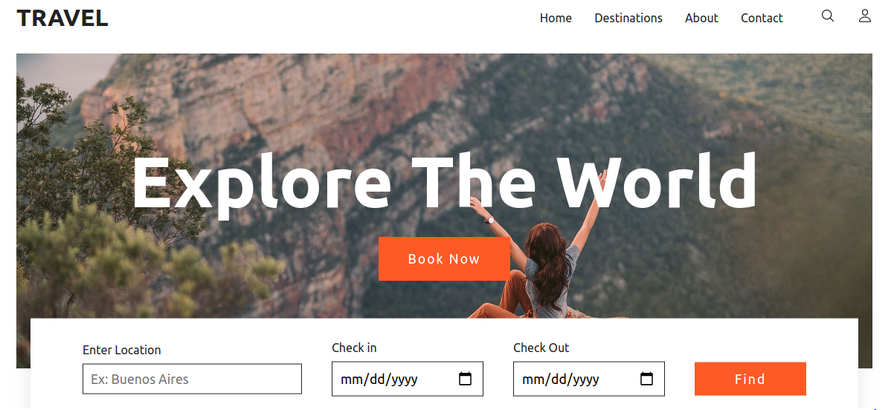
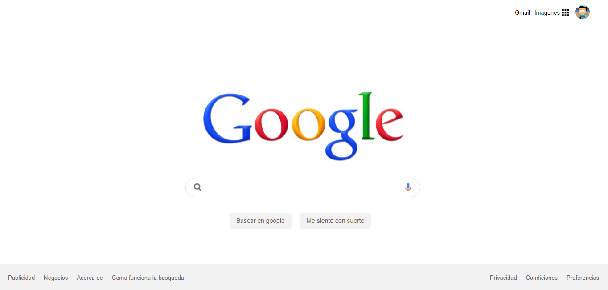
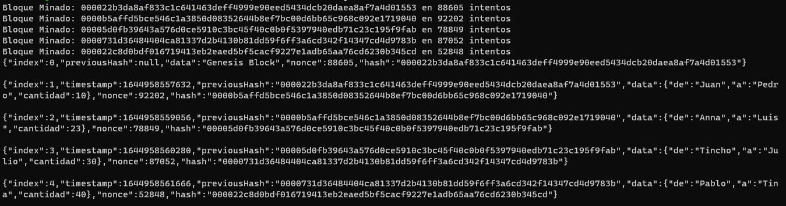
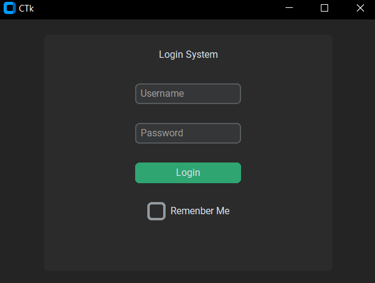

# Online Tutorial

### [Source](./TravelWebsite) || Travel Website || [Tutorial](https://www.youtube.com/watch?v=zcOoapSi-uM)

---

### [Source](./ImageGallery) || Image Gallery

---

### [Source](./GoogleClone) || Clone Google

---

### [Source](./Blockchain) || Blockchain Concepts || [Tutorial](https://www.youtube.com/playlist?list=PLImOJ2OqvvkCMESiO1Sps7i-YSYAmgw6n)

---

### [Source](./UserInterfacesPython) || Create User Interfaces Python || [Tutorial](https://www.youtube.com/watch?v=iM3kjbbKHQU)

---

- { outline: solid 1px tomato !important; }

---

### Data Science Course

| Description                                                                                     | Link                                                   | Status |
| ----------------------------------------------------------------------------------------------- | ------------------------------------------------------ | ------ |
| Python for Data Science Course – Hands-on Projects with EDA, AB Testing & Business Intelligence | [Youtube](https://www.youtube.com/watch?v=FTpmwX94_Yo) | 🟡     |

### PORYECTOS

Build a Full Stack Movie Streaming App in Go – Golang, React, MongoDB, OpenAI API Project Course
https://www.youtube.com/watch?v=jBf7of9JTV8

Go REST API for Beginners - Todo App with Gin, PostgreSQL & JWT Auth
https://www.youtube.com/watch?v=S069igHKUIw

Build and Deploy a Full Stack AI SaaS with Next.js 16, React, Honojs, Tailwind | Full Course
https://www.youtube.com/watch?v=MeXWSpx48q0&t=268s
